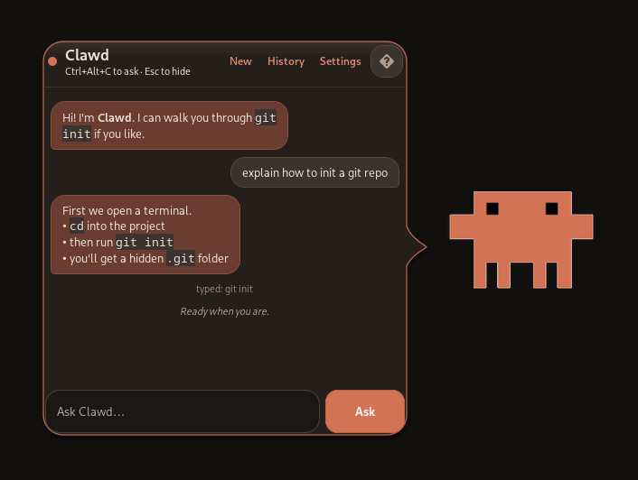

# Clippy for XFCE

A native XFCE companion that sits on your desktop, talks in a speech bubble, remembers past chats, looks at the screen, and uses **Claude Computer Use** to click, type, and run tools.



## What you get

- Authentic Office Assistant animations (43 of them) plus the original sound set
- Always-on-top paperclip that you can drag, right-click, or summon with `Ctrl+Alt+C`
- Speech-bubble chat with conversation history
- Long-term memory across chats
- Live desktop context: windows, workspace, clipboard, time
- Screen capture for Claude, with Clippy hidden so it does not photobomb itself
- Computer use: screenshot, zoom, click, drag, scroll, type, keys
- Live captions while it works, so it can explain a step as it does it
- Bash and a precise text-editor tool
- XFCE integration: `.desktop` launcher, tray icon, optional autostart

## Requirements

- XFCE on X11 (this laptop profile: XFCE 4.20)
- Python 3.11+ with GTK 3, PyGObject, Wnck
- An Anthropic API key

System packages already used: `python-gobject`, `gtk3`, `libwnck3`, `libayatana-appindicator`, `libkeybinder3`, `xclip`, `python-pillow`.

## Install

```bash
make install
clippy
```

Or:

```bash
./scripts/install.sh --dev
```

The first run opens settings if no key is found. Clippy also looks for `ANTHROPIC_API_KEY` and common local config files.

## Use

- Click Clippy or press `Ctrl+Alt+C` to talk (also works from the tray)
- Drag Clippy anywhere — the bubble follows
- While it is working: the mascot hides so it cannot click itself. **Escape** still stops (it is grabbed globally while hidden). Tray **Stop** and `clippy --stop` also halt. `Ctrl+Alt+C` brings the bubble back to steer.
- Escape hides the bubble when Clippy is idle
- Right-click for Stop, Pause computer use, New chat, History, Settings, Hide, Quit
- **?** in the chat (or F1) lists keyboard shortcuts. Click the mascot to hide the chat.
- Settings: mascot (Clippy or Clawd), model, computer-use confirmations, screenshot policy, size, sounds, autostart, optional mouse-dodge (hold Shift to click)

```bash
clippy              # start the companion
clippy --ask        # summon Clippy and the speech bubble
clippy --stop       # halt the current task
clippy --new        # start a fresh chat (keeps long-term memory)
clippy --say "…"    # send a message to the running Clippy
clippy --quit
clippy --prepare    # extract sprites/sounds and exit
```

Destructive shell commands always ask first unless you set confirmations to “never”.

## Tests

```bash
make test
```

A live API check runs only when `ANTHROPIC_API_KEY` is set.

## Assets

Sprites, animation data, and sounds come from [clippy.js](https://github.com/pi0/clippyjs) (extracted from the original Office Assistant). Clippy the character remains a Microsoft creation. Application code is MIT.

Re-download:

```bash
python3 scripts/fetch_sprites.py
```
